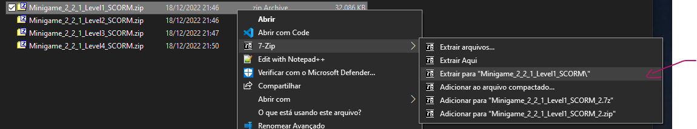
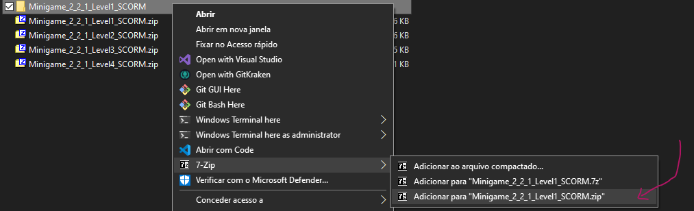
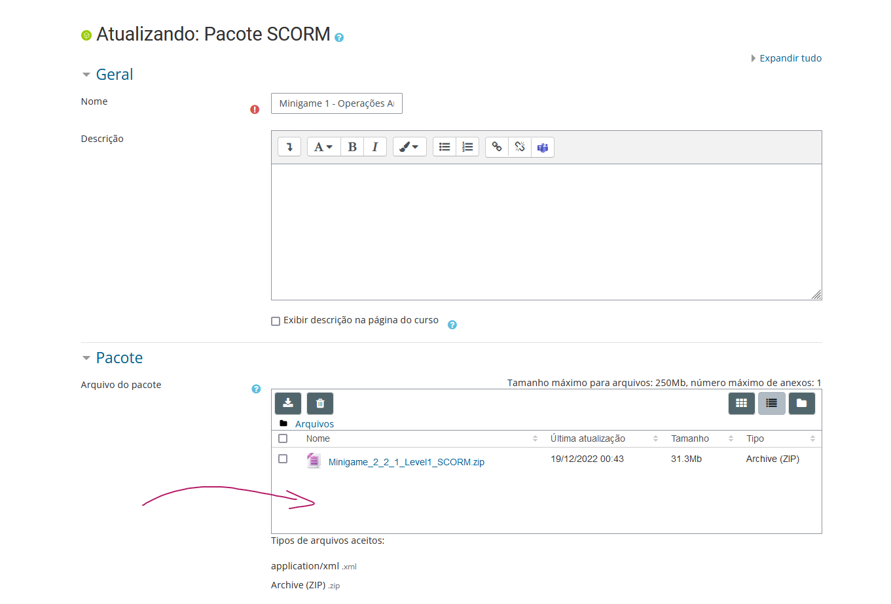

# MagicBits_OSS

Contains scripts and assets made by the MagicBits' team.

The `MagicBits` is an educational game to practice about computer systems.

## Dialogue DBs

Sistema de banco de dados dos diálogos. Também utilizado para gerenciamento das questões e respostas dos exercícios nos minigames.

### Talker Maker Deluxe

Ferramenta utilizada para edição externa dos Banco de Dados. Como este não oferece opção de import, foram criados projetos que replicam o Banco de Dados interno.

- Link: https://github.com/digiwombat/TalkerMakerDeluxe/releases
    - Baixe o `.exe` e instale.
    - Última versão testada: **v2.2.2**

#### Escrevendo diálogos

Organizado em estrutura de árvore. O jogador sempre é quem inicia o diálogo. Cada ramificação representa uma possível linha de diálogo entre o **Player** e o **NPC** em questão, este podendo assumir diferentes nomes (e.g., *Woman*).

No projeto `Minigame_2_x-Level1-TalkerMaker.json` existe a *Conversation* entitulada de *Woman*. Essa conversa
representa um diálogo linear (somente 1 linha de diálogo) em que o jogador inicia a interação e é sempre o **NPC** quem fala (*nodes* com **NPC** como *Actor*).

[//]: # (TODO: Conferir padrão de diretórios.)

- Cada *node* representa 1 **diálogo**, um conjunto de *diálogos* é 1 **conversa** (*Conversation*).
- O *node* raiz deve ter o **Player** como *Actor* (quem dispara o diálogo).
    - Nos demais, o *Actor* deve ser setado conforme quem deve falar.
- A listagem do campo *Actor* representa os items na aba *Characters*.
- O título da *Conversation* deve ser o mesmo que o parâmetro *Conversation Name* mostrado pela interface de Debug (localizada abaixo do *Actor* em jogo quando ativada).
- O textos devem ser colocados no campo *Dialogue*.

#### Escrevendo questões

Foi utilizado a mesma arquitetura dos diálogos para as questões. Porém, a escrita das questões deve seguir as seguintes convenções:

- Árvore de 3 níveis

    RAIZ (0) -> PERGUNTA (1) -> RESPOSTA (2)

- Cada ramificação na árvore representa 1 questão do mesmo *puzzle*.
- O texto da *Resposta* pode ser concatenado usando o símbolo `;`. Como cada posição é utilizada depende de cada *puzzle*.
    - Às vezes, representa uma sequência que o jogador tem de escolher para acertar a questão.
    - Às vezes, a 1ª posição é a resposta correta e as demais são alternativas falsas.
    - etc.

#### Exportando DB e atualizando pacote SCORM

1. Garanta que as alterações no projeto foram salvas (olhe as observações abaixo).
1. Vá em `Files -> Export to Chat Mapper XML` e salve o arquivo `.xml` no padrão `<minigameName>-<levelName>-DB.xml` (apresentado pela interface de Debug em jogo).
1. Descompacte o `.zip` do pacote SCORM referente ao minigame cujo é desejado alterar o DB (`<minigameName>-<levelName>-SCORM.zip`).

    

1. Acesse a pasta descompactada e vá em `Resources`. Dentro deve conter o arquivo `<minigameName>-<levelName>-DB.xml` que se deseja substituir.
1. Substitua o arquivo pelo novo exportado no *TalkerMaker*, garanta que o nome continue o mesmo.
1. Volte para onde se encontra a pasta `<minigameName>-<levelName>-SCORM` e gere um novo `.zip` de mesmo nome (agora com o novo DB).

    

1. Agora é só substituir o `.zip` antigo pelo novo no Moodle.

    

#### Observações

- Para salvar, vá em `Files -> Save Project`. O atalho `CTRL+B` não está funcionando.
- O inspetor na direita mantém aberto o último *node* selecionado, mesmo ao mudar de *Conversation*. Cuidado para não alterar o *node* incorreto.
- Se as alterações não aparecerem na interface, provavelmente não foram consolidadas, experimente inserir e deletar um *node*.

### Contribuindo para o repositório

#### Diálogos

Os projetos do `TalkerMaker Deluxe` são guardados em `Docs/TalkerMakerDeluxe/Projects`. Você pode integrar suas mudanças abrindo um Pull Request com suas alterações neste diretório. Dessa forma, futuras builds do `MagicBits` terão os diálogos atualizados.

#### Código

Entre em contato com um dos mantenedores.

